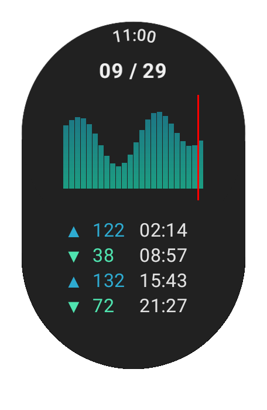

# Black Kite Gauntlet

A Wear OS app to see local tide levels.

This is a port of my [Black Kite](https://calbert1209.github.io/black-kite/) web app. (calbert1209/black-kite)

## Why

My family loves the ocean. When the tide is low, we explore the rocky shore near our home. My son and I connect by our curiosity about the creatures in tide pools. My daughter and I bound over the excitement of finding [cowrie](https://en.wikipedia.org/wiki/Cypraea) shells. And my wife loves the chance to have peace and quiet while we are out of the house. 😅

Knowing when the tide will be low helps me plan free and wholesome entertainment.

## Sources

Tide data is currently hard-coded for my nearest measurement station, [Shonanko（湘南港）](https://www.data.jma.go.jp/kaiyou/db/tide/suisan/suisan.php?stn=D8), in Kanagawa. Data comes from the [Japan Meterological Agency（気象庁）](https://www.jma.go.jp/jma/index.html)website. (Hurray for open data.👏🏼)

## TODO

- [ ] feature: ability to switch between measurement stations in Japan
- [ ] feature: ability to jump to "super events" such as days with extremely low tides
- [ ] documentation: how to gather and normalize data
- [ ] documentation: how to populate database

## Naming

The [black kite](https://en.wikipedia.org/wiki/Black_kite) _Milvus migrans_ is a species of predatory bird that sores above the shoreline near my home in Japan.

A [gauntlet](https://en.wikipedia.org/wiki/Falconry_training_and_technique#Gauntlets) is a special glove worn by falconers to allow falcons to protect their hand from the bird's sharp talons.
